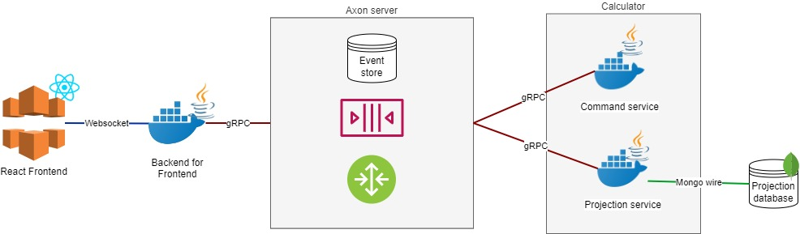

# CQRS and Event Sourcing example of calculator
Simple example of calculator that is implemented on the spring boot backend using Axon Framework + websocket communication with FE.

## How to start project
- Run docker environment using [docker-compose.yaml](local-environment/docker-compose.yaml)
- FE
  - install and run it in folder [web](web) using commands `npm install` and `npm start`
- BE 
  - Run `mvn clean install` for [backend-parent pom](backend/pom.xml)
  - Run Springboot app [BFF](backend/bff/src/main/java/cz/assist/axon_training/bff/BFF.java)
  - Run Springboot app [Calculator command service](backend/calculator-domain/calculator-command-service/src/main/java/cz/assist/axon_training/command/DomainCalculatorCommandService.java)
  -  Run Springboot app [Calculator projection service](backend/calculator-domain/calculator-projection-service/src/main/java/cz/assist/axon_training/projection/DomainCalculatorProjectionService.java)

## Technologies used
- Java 17
- Springboot 2.7
- Axon Framework 4.6
- MongoDB 5 + MongoDB java driver 4.8
- Websocket
- Typescript 4.9
- React 18

## Application schema

